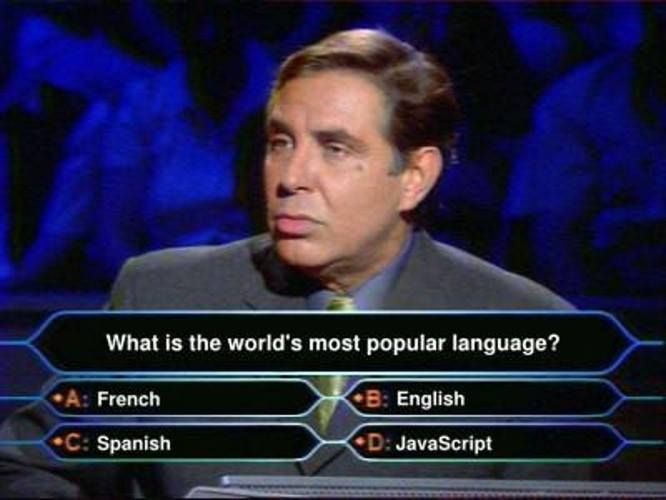
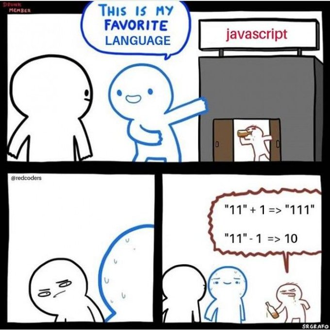
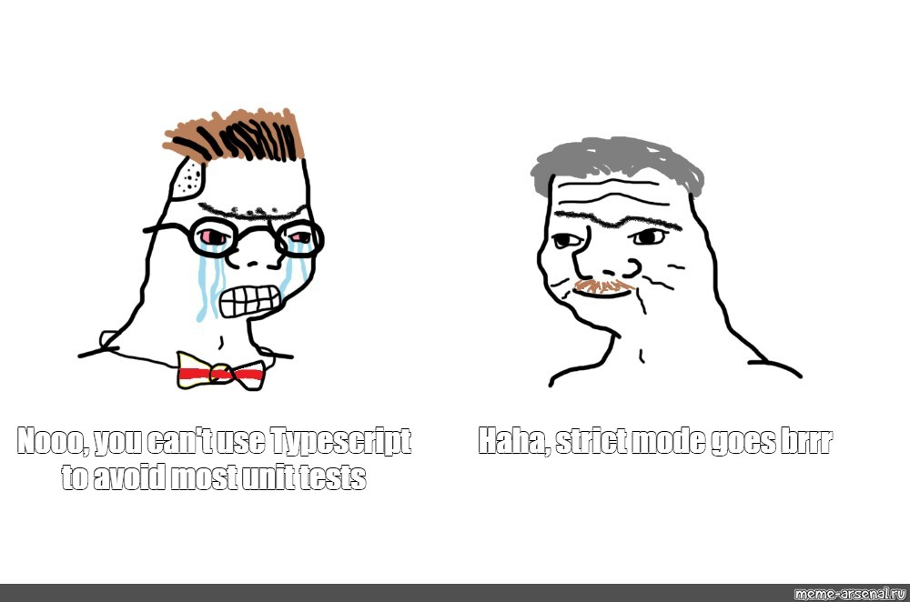
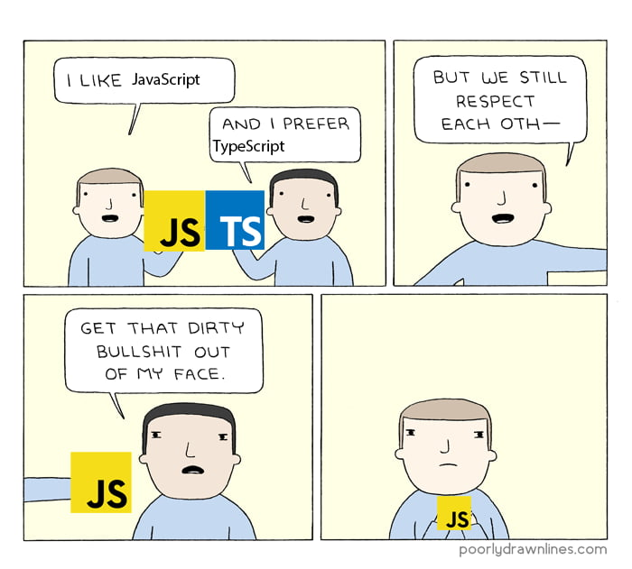
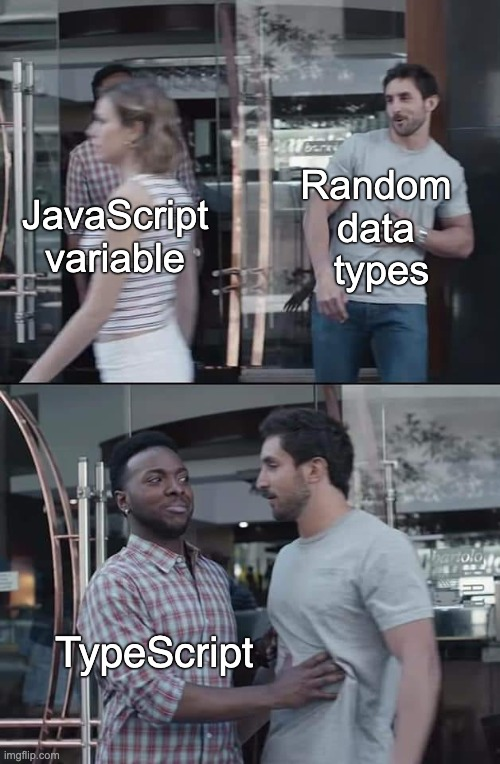
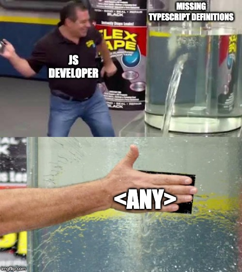
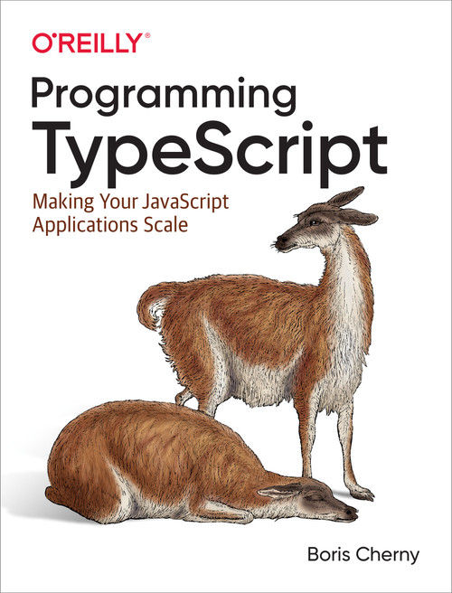

# TypeScript Basics

- Why TypeScript
- Basic Types
- Basic Fetching
- Overloading
- Generics
- keyof
- Where to go from here

---

##

|                                        | Why TypeScript                                                                                                                                                                                                                                                                                     |
| -------------------------------------- | -------------------------------------------------------------------------------------------------------------------------------------------------------------------------------------------------------------------------------------------------------------------------------------------------- |
|  | - TypeScript is the language that will power the next generation of apps, IoTs, Node projects and the web. <br><br> - It will reduce the necessary amount of unit tests by type-checking everything at compile time. <br><br> - It will increase the safety of your code by reducing humans error. |

---

## What would you need TypeScript for?



```ts
const sum = (x: number, y: number): number => x + y;
sum("11", 1);
// Argument of type 'string' is not
// assignable to parameter of type 'number'.
```

---

# Should you even bother with tests?



---

### Write tests

> The thing you should be thinking about when writing tests is how much confidence they bring you that your project is free of bugs. Static typing and linting tools like TypeScript and ESLint can get you a remarkable amount of confidence, That said, even a strongly typed language should have tests. Typing and linting can't ensure your business logic is free of bugs.

— Kent C. Dodds

---

# Companies in 2022



---

|                             | The Typechecker                                                                                                                                                                                                                                                                                                                                                                                   |
| --------------------------- | ------------------------------------------------------------------------------------------------------------------------------------------------------------------------------------------------------------------------------------------------------------------------------------------------------------------------------------------------------------------------------------------------- |
|  | The typechecker is the magic behind TypeScript. <br> - What you write goes through a compiler. <br> - The compiler transforms that into an AST <br> - Compiler converts the AST into bytecode <br> - Bytecode is fed to runtime <br> <br> \* AST: Abstract Syntax Tree, a data structure that ignores things like spaces and comments <br> \* Bytecode: A lower level representation of your code |

---

# Types in JavaScript vs TypeScript

| Type System Feature       | JavaScript          | TypeScript               |
| ------------------------- | ------------------- | ------------------------ |
| How types are bound?      | Dynamically         | Statically               |
| Are types auto-typed?     | Yes                 | No (mostly)              |
| When it type-checks?      | At Runtime          | At compile time          |
| When are errors surfaced? | At Runtime (mostly) | At compile time (mostly) |

- JavaScript needs to run your program to know its types.
- TypeScript is a gradually typed language, it works best when it knows all types for your programs

---

# Basic Types

- bigint
- boolean
- null
- number
- object
- string
- symbol
- undefined
- void

---

# Basic Types: Object

Object type usually describes a specific shape and it is rarely used as `type: object`. This is by design; TypeScript is structurally typed, e.g. we just care that an object has certain properties.

### Example:

```ts
const user: object = {
  name: "Pedro",
  age: Infinity,
};

console.log(user.name); // Property name does not exist on type 'object'
```

---

# Basic Types: unknown

Unknown is used for the few cases where you don't know ahead of time what type a value should have.

### Example:

```ts
const a = await fetch(url, options).then((data) => data.json());
const b = 10;
console.log(a + b); // Error: Object is of type unknown

if (typeof a === "number") {
  console.log(a + b); // returns a number
}
```

---

## Basic Types: any



By default all types go back to any and it must be avoided.

TypeScript may also infer types to you, but it is your duty as the programmer to ensure the inferred types are correct, and/or declare more specific types.

---

# Basic Types: never

Never is intended for the return type of a function that never returns.

```ts
function neverGonnaGiveYouUp {
  while (true) {
    neverGonnaLetYouDown()
  }
}
```

It could also be used to represent impossible scenarios

```ts
function doTheThing(value: string | number) {
  if (typeof value === "string") // value = string
  else if (typeof value === "number") // value = number
  else // value = never
}
```

---

# Types vs Interfaces

When should you use types? When should you use interfaces? For the most part they can be used interchangeably.
They are almost the same, but there are three differences and they're subtle.

---

# 1. Types vs Interfaces: Composition

Types are more general and can be any type, including a type expression. Interfaces must always be a shape.
There is no way to write the following as an Interface:

```ts
type A = number;
type B = A | string;
```

---

# 2. Types vs Interfaces: Extending

When you extend an interface, TypeScript will make sure that it _can_ be assigned to your extension.

```ts
interface A {
  ok(val: number): string;
  notOk(val: number): string;
}
interface B extends A {
  ok(val: number | string): string;
  notOk(val: string): string; // Type number is not assignable to type string
}
```

If you use types it will result in an overloaded signature for notOk instead of a compile error

---

## 3. Types vs Interfaces: Declaration Merging

Multiple interfaces with the same name will be merged together

```ts
interface User {
  name: string;
}
interface User {
  age: number;
}
interface User {
  country: Country;
}
const user: User = { name: "Pedro", age: Infinity, country: "Brazil" };
```

If you try it for types, you will get a duplication error.

---

# Basic Fetching

Fetching is an interesting example due to its unknown response nature. It is impossible to predict what the body `json()` may look like.

```ts
interface Body {
  readonly body: ReadableStream<Uint8Array> | null;
  readonly bodyUsed: boolean;
  arrayBuffer(): Promise<ArrayBuffer>;
  blob(): Promise<Blob>;
  formData(): Promise<FormData>;
  json(): Promise<any>;
  text(): Promise<string>;
}
```

---

# Basic Fetching

```ts
const response = await fetch("http://api.com/endpoint", options);
const responseJson = await response.json();
const squareOfResponse = responseJson ** responseJson;
// squareOfResponse is certainly of type number Since the response is of type unknown
// TypeScript gives us a compile time error "Object is of type 'unknown'"
```

```ts
const response = await fetch("http://api.com/endpoint", options);

if (response.ok) {
  const responseJson = await response.json();
  if (typeof responseJson === "number") {
    const squareOfResponse = responseJson ** responseJson;
  }
}
```

---

# Basic Fetching: Typecasting

It is also common to typecast your response. Typecasting is used when you know better than TypeScript what a value may be.
Example:

```ts
interface User {
  id: string;
  name: string;
  age: number;
}
const response = await fetch("http://api.com/user/id", options);

if (response.ok) {
  const user = (await response.json()) as User;
  return user;
}
```

---

# Overloading

TypeScript models the dynamism of JavaScript.
Overloaded declarations and functions outputs that depend on the input type.

---

<!-- _backgroundColor: #112040 -->

```ts
interface User {
  id: string;
  name: {
    first: string;
    last: string;
  };
}

const user: User = {
  id: "123",
  name: {
    first: "John",
    last: "Doe",
  },
};

const sayHello = (user: User, isFamilyFirst: boolean = false) => {
  const name = isFamilyFirst
    ? `${user.name.last} ${user.name.first}`
    : `${user.name.first} ${user.name.last}`;
  console.log(`Hello ${name}`);
};
```

---

<!-- _backgroundColor: #112040 -->

### What if we work with different shapes?

```ts
interface User2 {
  id: string;
  firstName: string;
  lastName: string;
}

interface User3 {
  id: string;
  fullName: string;
}

const sayHello = (
  user: User | User2 | User3,
  isFamilyFirst: boolean = false
) => {
  if (user.name.first) {
    // Property 'name' does not exist on type 'User | User2 | User3'.
    // Property 'name' does not exist on type 'User2'.ts(2339)
  }
};
// Wait, that sounds like it should work?
```

---

<!-- _backgroundColor: #112040 -->

### Overloaded types and functions

```ts
interface OverloadedUser {
  id: string;
  name?: string | User["name"];
  firstName?: string;
  lastName?: string;
}
function sayHello(user: User, isFamilyFirst?: boolean): void;
function sayHello(user: User2, isFamilyFirst?: boolean): void;
function sayHello(user: User3, isFamilyFirst?: boolean): void;

function sayHello(user: OverloadedUser, isFamilyFirst: boolean = false) {}
```

---

<!-- _backgroundColor: #112040 -->

```ts
function sayHello(user: OverloadedUser, isFamilyFirst: boolean = false) {
  let name: string = "";

  if (typeof user.name === "string") {
    const splitName = user.name.split(" ");
    name = isFamilyFirst
      ? splitName[1] + " " + splitName[0]
      : splitName[0] + " " + splitName[1];
  }
  if (typeof user.name === "object" && user.name.first && user.name.last) {
    name = isFamilyFirst
      ? user.name.last + " " + user.name.first
      : user.name.first + " " + user.name.last;
  }
  if (typeof user.firstName === "string" && typeof user.lastName === "string") {
    name = isFamilyFirst
      ? user.lastName + " " + user.firstName
      : user.firstName + " " + user.lastName;
  }
  console.log(`Hello ${name}`);
}
// The function above still has a major problem, can you spot it?
```

---

# Generics: Generic Type Parameter

Generics are a fundamental feature of statically-typed languages. It is a placeholder type used to enforce a type-level constraint in multiple places.

A generic function has the ability to accept and enforce typing that is passed in when it is used.

Use generics whenever you can. They will help keep your code general, reusable and concise.

---

<!-- _backgroundColor: #112040 -->

### Rewriting our fetching function with Generics

```ts
export function fetchContainer<T>({
  controller,
  url,
}: FetchContainer): Promise<T> {
  return new Promise(async (resolve, reject) => {
    const response = await fetch(url, { signal: controller.signal });

    if (response.ok && response.status === 200) {
      const jsonResponse = (await response.json()) as T;
      resolve(jsonResponse);
    } else if (controller.signal.aborted) {
      reject("Connection aborted");
    } else {
      reject(new Error(`Failed to Fetch ${url}`));
    }
  });
}
```

---

# Let's catch Pokemons!

Building our interface

```ts
export interface Pokemon {
  id: number;
  name: string;
  base_experience: number;
  height: number;
  is_default: boolean;
  order: number;
  weight: number;
}
```

---

# Fetching with our Generic

```ts
async function getPokemonByName(
  name: string,
  controller: AbortController
): Promise<Pokemon> {
  const url = `https://pokeapi.co/api/v2/pokemon/${name}`;
  try {
    const pokemon = await fetchContainer<Pokemon>({ controller, url });
    return {
      id: pokemon.id,
      name: pokemon.name,
      base_experience: pokemon.base_experience,
      height: pokemon.height,
      is_default: pokemon.is_default,
      order: pokemon.order,
      weight: pokemon.weight,
    };
  } catch (error) {
    controller.abort();
    throw new Error(`Pokemon ${name} not found`);
  }
}
```

---

# Generics with keyof

A generic that extends keyof is great for autocompletion

```ts
function pluck<T, K extends keyof T>(items: T[], key: K): T[K][] {
  return items.map((item) => item[key]);
}
```

---

# Generics with keyof

```ts
function sortNumbersBy<T, K extends keyof T>(
  arr: T[],
  key: K,
  order: "asc" | "dsc" = "asc"
): T[] | undefined {
  if (typeof arr[0][key] !== "number") return;
  const copyOfArray = [...arr].sort(
    (a: T, b: T) => Number(a[key]) - Number(b[key])
  );
  return order === "dsc" ? copyOfArray.reverse() : copyOfArray;
}
```

---

<!-- _backgroundColor: #001133 -->

### Where to go from here

- [O'Reilly: Programming Typescript](https://www.oreilly.com/library/view/programming-typescript/9781492037644/)
- [TypeScript Docs](https://www.typescriptlang.org/docs/)
- [Free Code Camp](https://www.freecodecamp.org/news/learn-typescript-beginners-guide/)
- [TypeScript Playground](https://www.typescriptlang.org/play/)



---


